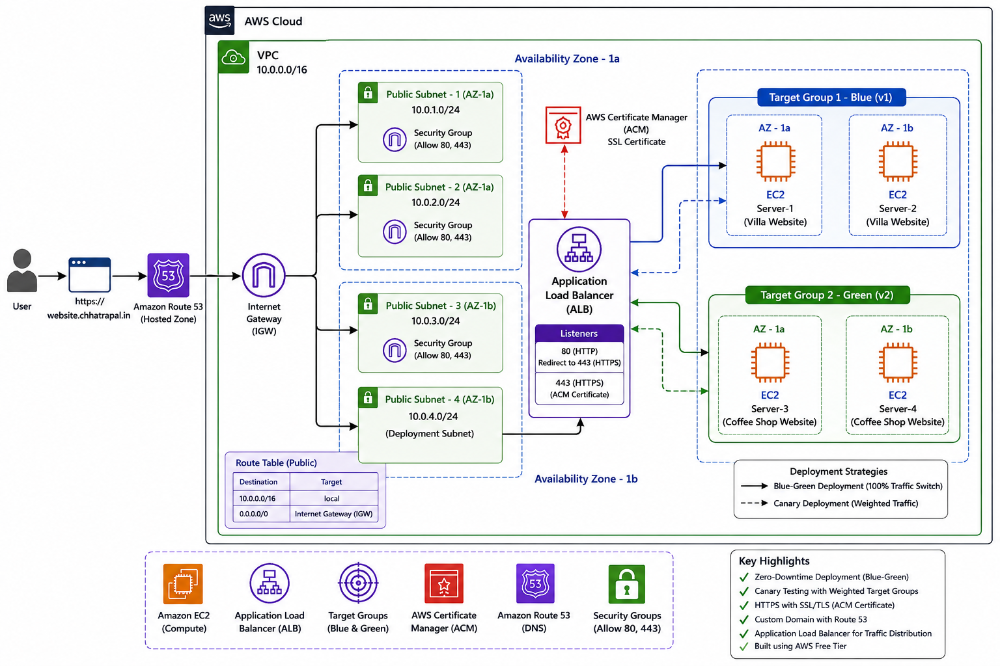

# AWS Zero-Downtime Deployment (Blue-Green & Canary)

## 📌 Project Overview
This project demonstrates how Blue-Green Deployment and Canary Deployment can be implemented on AWS using Amazon EC2 and Application Load Balancer.

The objective of this project is to understand zero-downtime deployment, SSL/TLS configuration, custom domain integration, and traffic shifting between application versions.

The project was deployed using the AWS Free Tier for learning purposes. After successful testing, the resources were removed to avoid unnecessary AWS charges.

---

## 📐 Architecture Diagram

---

## 🛠️ AWS Services & Technologies Used

| Service / Tools               | Purpose                                                 |
| ----------------------------- | ------------------------------------------------------- |
| Amazon EC2                    | Hosted Version 1 and Version 2 websites                 |
| Application Load Balancer     | Distributed traffic between Blue and Green environments |
| Target Groups                 | Separate routing for Blue and Green servers             |
| Auto Scaling Launch Template  | Learned EC2 launch template and AMI concepts            |
| Amazon Machine Image (AMI)    | Created reusable server images                          |
| AWS Certificate Manager (ACM) | SSL/TLS Certificate                                     |
| Amazon Route 53               | Custom domain and DNS routing                           |
| Security Groups               | Allowed HTTP and HTTPS traffic                          |
| Default VPC                   | Network environment provided by AWS                     |

---

## Deployment Strategy

# Blue-Green Deployment
Version 1 (Villa Website) was deployed on Server-1 and Server-2.
Version 2 (Coffee Shop Website) was deployed on Server-3 and Server-4.
Both versions were available simultaneously.
The ALB Listener was switched from Blue Target Group to Green Target Group without downtime.

# Canary Deployment
Traffic was gradually shifted using ALB Weighted Target Groups.
Example:

90% → Blue Environment
10% → Green Environment

After successful testing, traffic was switched completely to the Green Environment.

## SSL & Custom Domain

# This project also demonstrates:

Purchased a custom domain
Created a Hosted Zone in Route 53
Configured DNS records
Requested a Public SSL Certificate from ACM
Validated the certificate using DNS
Attached HTTPS Listener (443) to the Application Load Balancer

## What I Learned
Amazon EC2
Security Groups
Application Load Balancer
Target Groups
Blue-Green Deployment
Canary Deployment
Route 53
AWS Certificate Manager (ACM)
Launch Templates
Amazon Machine Images (AMI)
HTTPS Configuration
Custom Domain Integration

## 📸 Screenshots & Proof of Work

# AWS Console

# Application

